# 中国版 YSM 组件附包转换指南

本教程是讲述如何将 Java 版 Yes Steve Model（简称 YSM）模组的模型包转换成网易中国版 Yes Steve Model 组件附包的教程。

此教程认为你已经了解 Java 版 Yes Steve Model 模型是如何制作的。

> 请注意：加密格式的 Java 版 Yes Steve Model 模型（也就是以 `.ysm` 结尾的单个文件）**是无法读取并转换的**！
>
> 请注意：如果你制作的模型未得到模型原作者的允许，**请不要转换并发布**！我们不支持任何侵权盗取模型的行为！由此导致的后果也与我们无关！

## 一、准备工作

首先，你需要下载得到这两个文件：

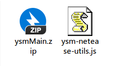

- `ysmMain.zip`：前置包，仅用于中国版 YSM 组件附包测试附属包，**请勿作它用**。
- `ysm-netease-utils.js`：BlockBench 插件，用于一键转换 Java 版 YSM 模型包。

其次，你的电脑上应该还需要安装这三个软件：

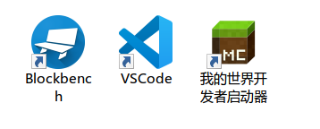

- `BlockBench`：制作模型的软件，这个应该都认识吧？
- `VSCode`：经典的文本编辑软件，因为部分高级内容可能需要改动脚本文件，所以建议安装此软件。
- `我的世界开发者启动器`：网易官方专用于组件开发的软件，需要注册开发者账户才可以登录使用。下载地址：<https://mc.163.com/dev/>

## 二、插件安装

首先，打开你的 BlockBench 软件，将先前的 `ysm-netease-utils.js`（**注意不要修改文件名，也不要安装后就删除此文件）** 直接拖入 BlockBench 中。

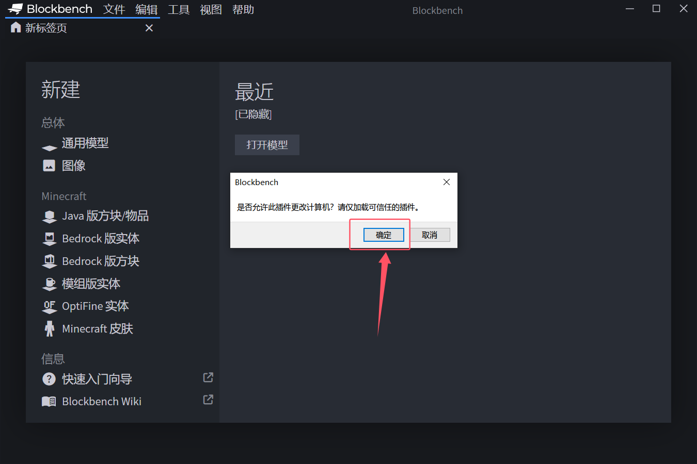

点击确认即可，此时你在 `文件 -> 插件` 菜单中就能看到加载的插件了：

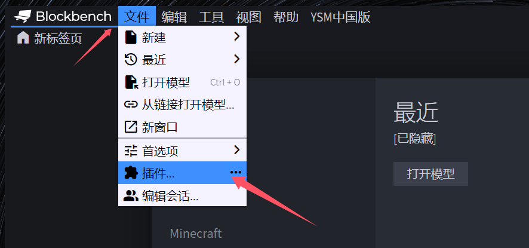

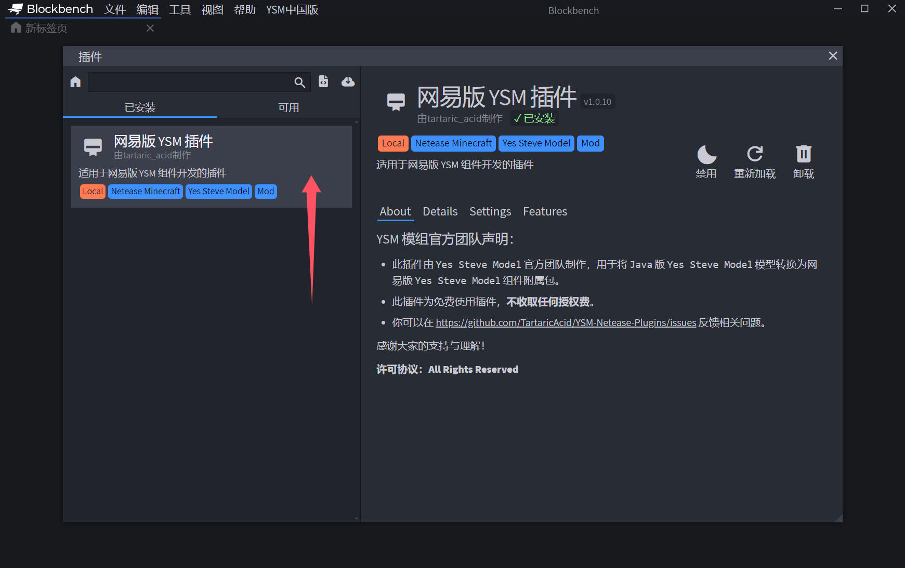

## 三、转换模型

现在，我们开始转换 Java 版 YSM 模型。

在 BlockBench 中打开此菜单：

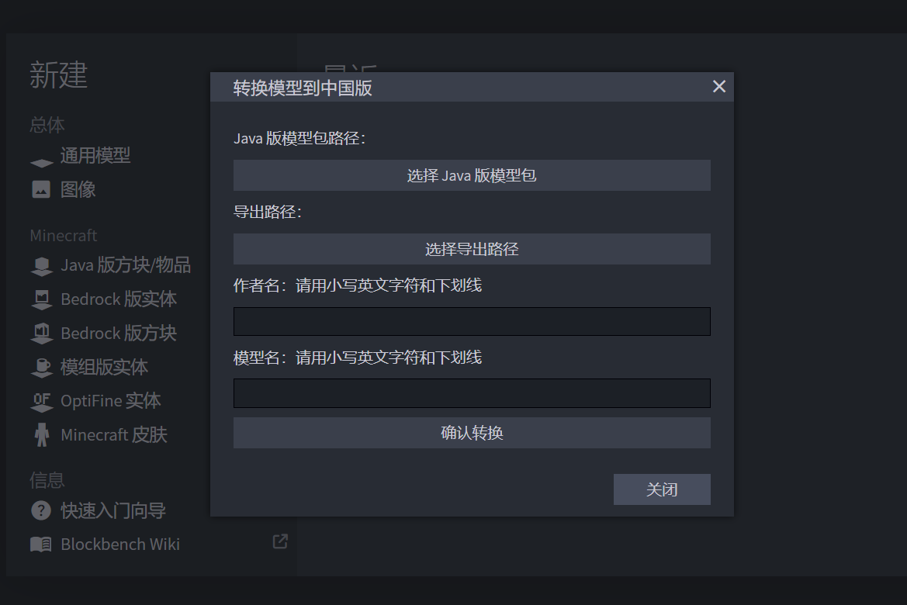

点击 `选择 Java 版模型包` 按钮，随后选中你需要转换的 Java 版 YSM 模型包文件夹。

接着点击 `选择导出路径` 按钮，选择你要放置转换后组件包的路径。

> 请注意，中国版组件包不支持路径中带中文，建议选择一个纯英文路径，比如放置在桌面。

最后填写作者名和模型名，这两个名字最后会被插件自动拼接成你组件包的 ID，请尽量选择较长的，不易产生冲突的名字。

> 请注意，中国版组件包不支持 ID 带中文，请务必填写小写英文字符或者下划线，不要使用中文或者空格

## 四、测试模型

现在你转换后的组件包已经弄好了，我们进入游戏测试吧！

首先打开 `我的世界开发者启动器`，登录账户，并选择 `创作 -> 本地导入 -> 导入基岩版组件`：

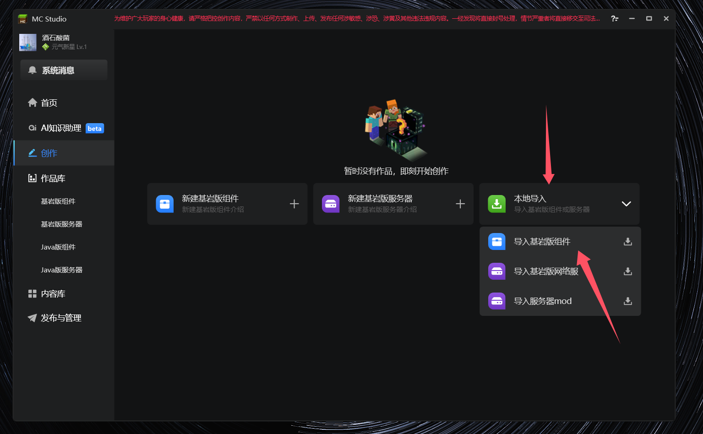

然后将我们刚刚下载的 `ysmMain.zip` 前置包导入，随便起个名字即可，然后点击导入。

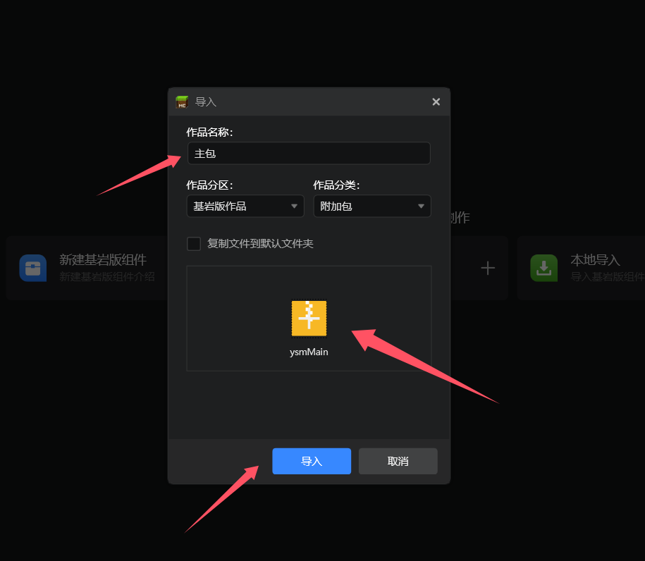

接着把我们刚刚插件转换后的文件夹也如法炮制，导入：

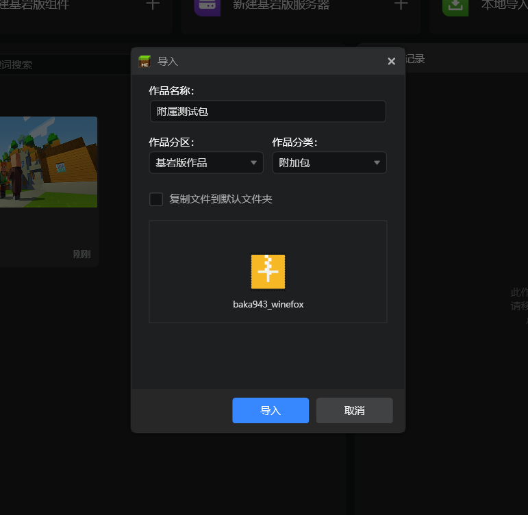

接着选择主包（附属包也可以，随便你哪个），点击开发测试按钮：

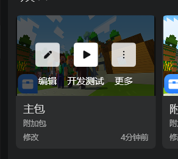

随便选一个版本，3.1、3.2 都可以：

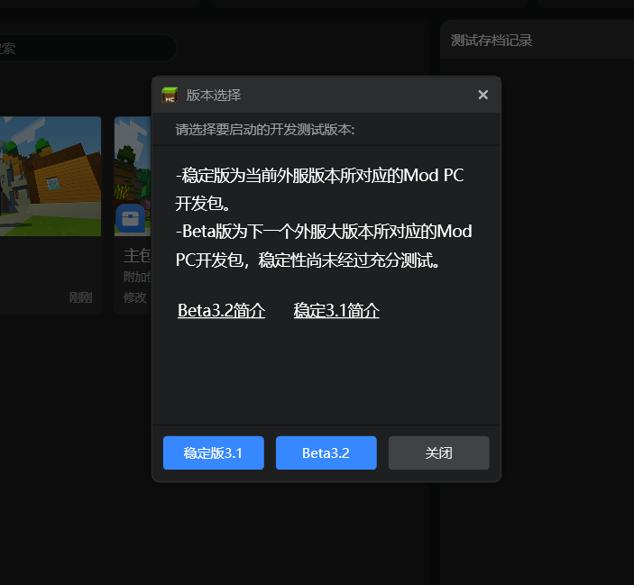

然后这个界面需要做两处修改：

- 勾选上我们的主包和附属包
- 选择创造模式（不然测试几下就被怪打死了不妥吧）

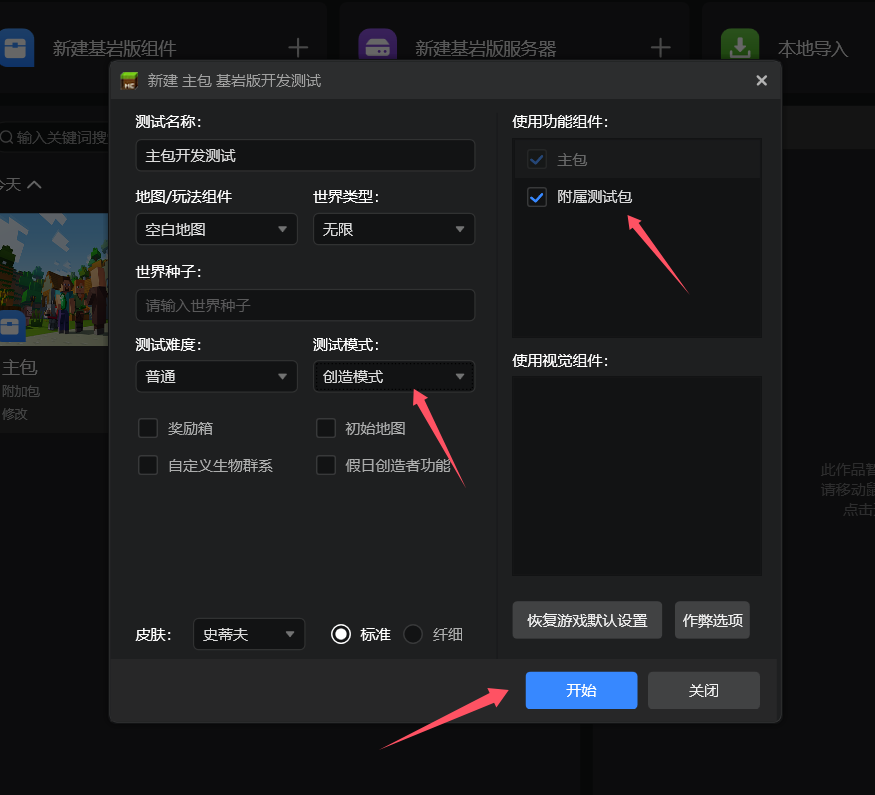

点击开始按钮，运行游戏即可，之后就是按照正常流程游戏内使用 YSM 组件即可：

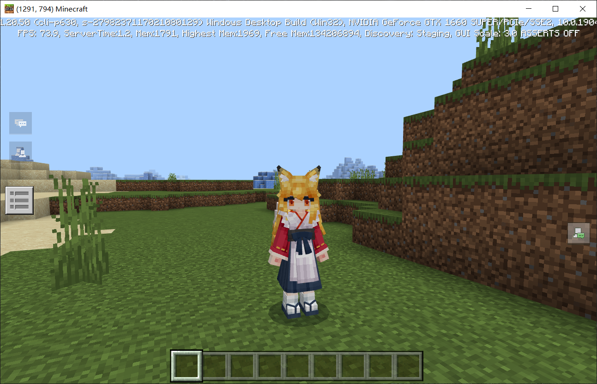

## 五、问题反馈

如果你遇到了问题，我们可能会像你索取日志文件，日志文件可以通过点击此处导出：

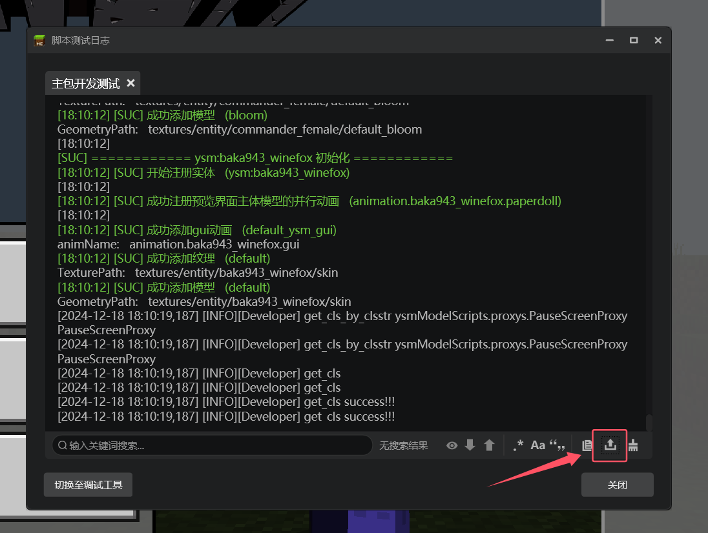
