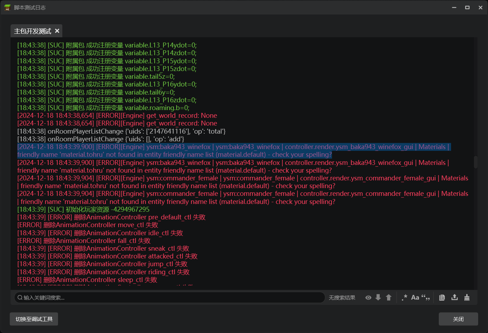
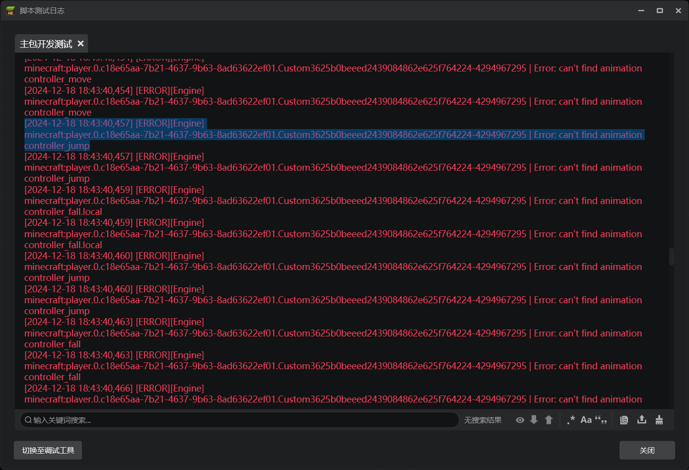
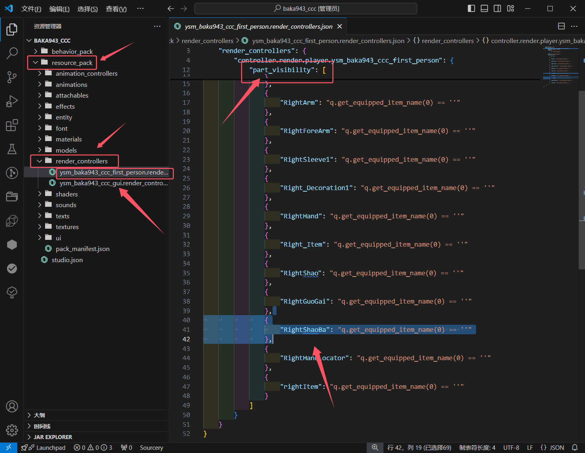
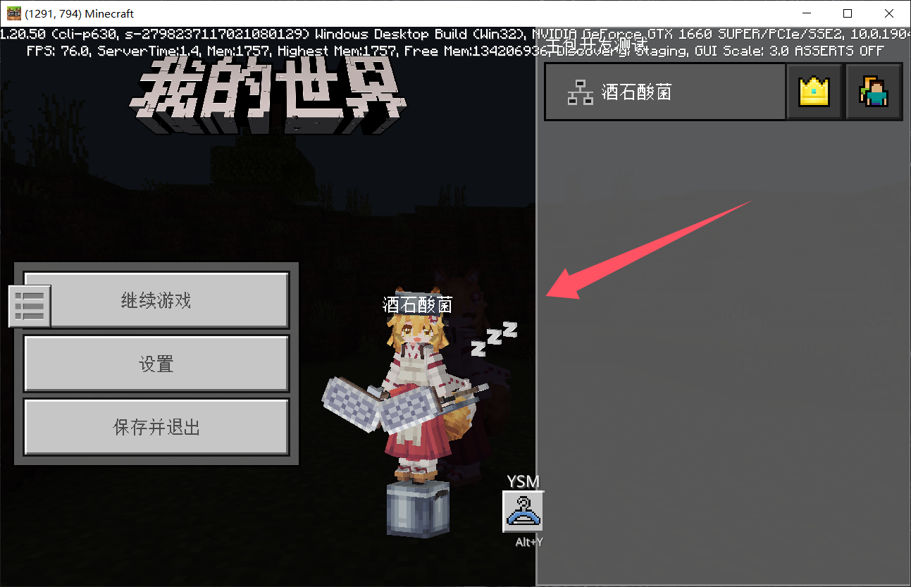
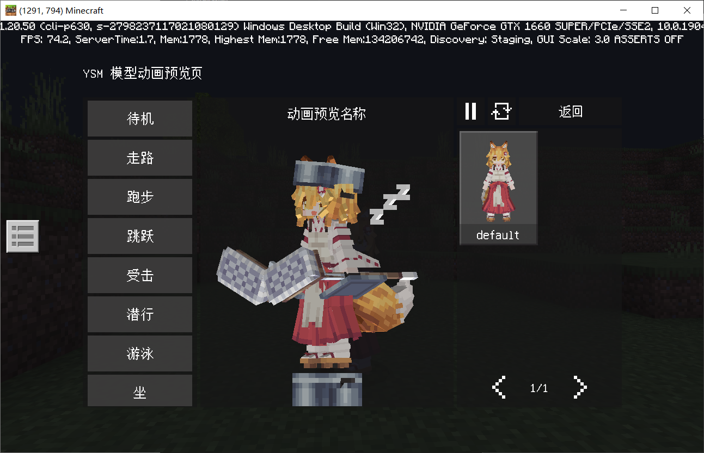
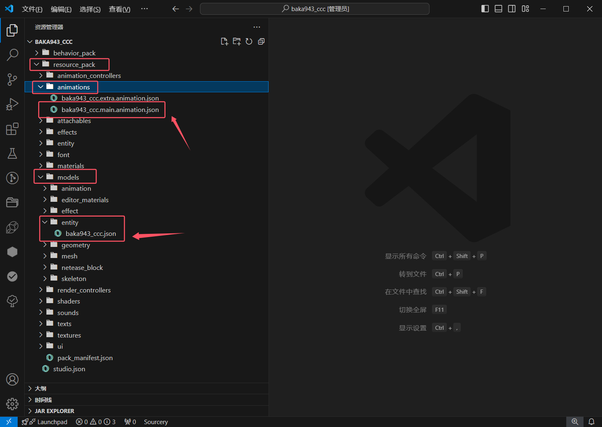
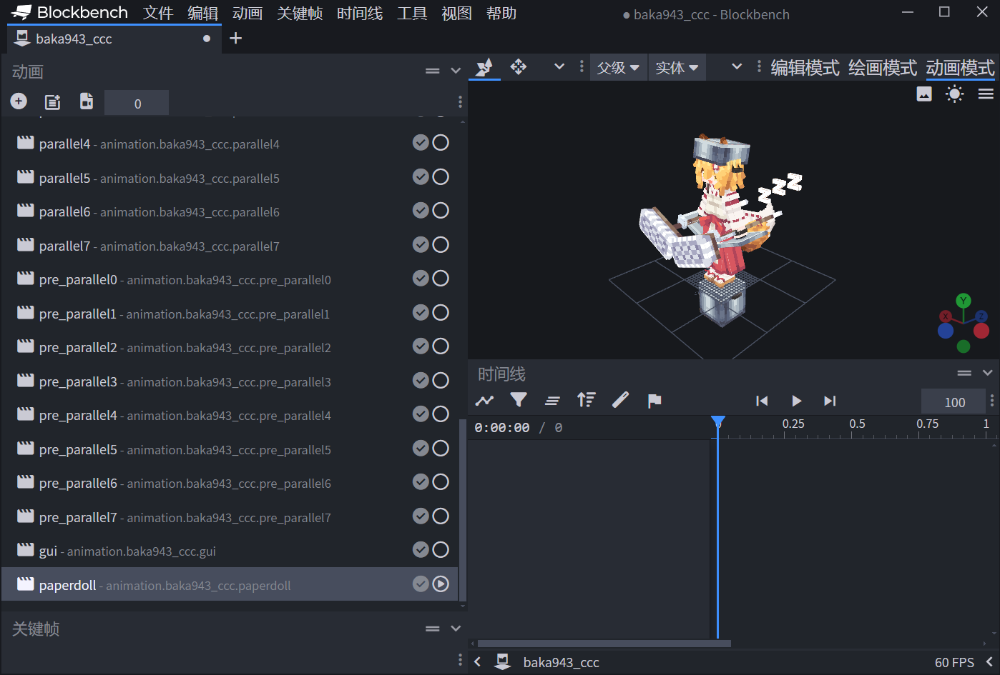

# 转换常见问题
[toc]

## 一、部分日志后台报错

### 如果是下面几个错误，暂无影响，不需要考虑：

`friendly name 'material.tohru' not found in entity friendly name list (material.default) - check your spelling?`

`Error: can't find animation xxx`

## 二、第一人称手臂模型模型有多出来的部分或者缺失部分内容

第一人称手臂模型的是由插件自动识别 `RightArm` 组下所有的子组来实现的，如果你没有 `RightArm` 组，或者 `RightArm` 组包含了多余的骨骼，就会导致上述问题。

> （画饼）：后续计划添加插件功能，可以自行选择需要显示的组

### 解决办法：

首先，按照下图，找你转换后的组件包内的这个文件，并用 `VScode` 打开：

在 `part_visibility` 字段下删除多余的、不应当显示的组即可。有缺失的组，也可以如法炮制进行添加。

## 三、在某些界面，模型会显示出本该隐藏的模型

具体情况如下图所示，本该隐藏的部分显示了出来：

### 解决办法：

这个两个界面的 GUI 中调用的动画名是 `paperpoll`，插件默认生成的 `paperpoll` 动画可能会有些许问题，你需要自行为其修正内容来隐藏某些组件。

因为基岩版的机制，我们在 GUI 中的设计是仅播放 `paperpoll` 动画，**不会播放任何并行动画**！所以你在 GUI 中播放的动画不易过于复杂，也不建议使用 `molang` 语句，否则会十分卡。

模型文件在 `resource_pack\models\entity` 路径下。动画文件在 `resource_pack\animations` 路径下，一般你只需要加载名为 `main.animation.json` 的即可。

## 四、打开 GUI 模型切换界面时，后台疯狂报错

报错信息可能是这样的：`Error: unhandled request for unknown variable 'variable.xxx'`

### 解决办法：

GUI 和纸娃娃动画不支持 molang 变量，请检查自己的 `gui` 和 `paperdoll` 动画。是否添加了 molang！
